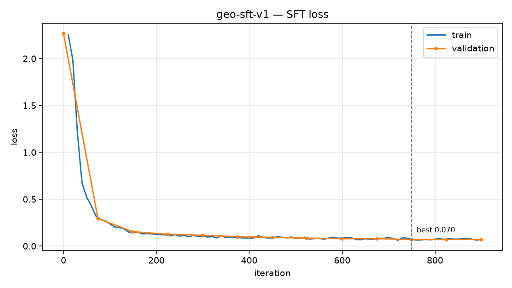

# Results

Everything measured on this project, with the caveats that make the numbers
mean something. All figures are reproducible via `make all`.

---

## 1. Setup

| | |
|---|---|
| Hardware | Apple M4 Pro, 48 GB unified memory (40.2 GB MLX working set) |
| Base model | `mlx-community/Qwen3-4B-Instruct-2507-4bit` |
| Method | QLoRA — frozen 4-bit base, rank-16 LoRA on the top 16 layers |
| Trainable | 1.25 M of 1.72 B parameters (0.072%) |
| Framework | mlx 0.32.2 / mlx-lm 0.31.3 |
| Effective batch | 16 (batch 4 × accumulation 4) |
| LR | 1e-4 peak, linear warmup then cosine to 1e-5 |
| Loss | completion-only (`mask_prompt`), on the JSON answer alone |

## 2. Dataset

| stage | count |
|---|---|
| Geolex units requested | 4,000 |
| Units yielding usable prose | 3,302 |
| Passages extracted | 8,757 |
| Dropped as duplicates | 51 |
| Dropped as low-signal (<2 filled fields) | 390 |
| **Kept** | **8,316** across 3,257 units |
| train / valid / test | 6,635 / 802 / 879 |
| gold (held out of everything, hand-correctable) | 150 |

Split is **group-wise on `unit_id`**, so the seven near-identical passages
about the Aarde Shale Member all land in one split. A random split would leak
them across the wall and inflate test scores.

### Labeller audit

The labeller never reads Geolex's curated metadata, which leaves that metadata
free as independent ground truth (2,000-passage sample):

| check | value |
|---|---|
| unit_name retained | 85.5% |
| chronostrat consistency with curated ages | **89.5%** |
| states precision / recall | 0.581 / 0.233 |

Field fill rates: lithologies 91.3%, chronostrat 80.8%, rank 70.6%, relations
47.2%, thickness 44.4%, states 42.3%, minerals 24.1%.

The states figures are low **by design**. We extract states *named in the
passage*; Geolex curates every state the unit occurs in across all references.
Different questions — it is a drift tripwire, not an accuracy score.

## 3. Tokenizer analysis

An 8,000-token BPE tokenizer trained on the train split only.

**Fertility (tokens per word — lower is better):**

| corpus | base (Qwen3) | geo tokenizer |
|---|---|---|
| geoscience passages | 1.701 | **1.527** (−10.2%) |
| general English | **1.123** | 1.938 (+72.6%) |

That second row is the entire argument against swapping tokenizers. The domain
tokenizer wins modestly on domain text and loses catastrophically everywhere
else — and you cannot swap it into a pretrained model anyway.

**1,918 of 2,223 domain terms cost the base tokenizer 3+ tokens.** Ranked by
tokens actually wasted (frequency × pieces−1):

| term | base tokens | corpus uses |
|---|---|---|
| Pennsylvanian | 4 | 873 |
| Cretaceous | 3 | 1,069 |
| unconformably | 3 | 1,030 |
| stratigraphic | 3 | 726 |
| Mississippian | 4 | 479 |

Ranking by raw fragmentation instead surfaces junk:
`Clino-ferro-ferri-fluoro-holmquistite` costs 16 tokens and occurs zero times.

## 4. Vocabulary extension

512 terms grafted onto Qwen3-4B with mean-of-subwords initialisation.

| | |
|---|---|
| Tokens added | 512 |
| Tokenizer length | 151,669 → 152,181 |
| Embedding rows | 151,936 → 152,192 (grew; never shrank) |
| Tied embeddings | yes — `lm_head` written once |
| Quantised | 4.501 bits/weight |

```
base    (18 tokens): Penn|s|ylv|anian| s|ilt|stone| uncon|form|ably| over|lying| Ord|ov|ician| g|ne|iss
extended (7 tokens): Pennsylvanian| siltstone| unconformably| over|lying| Ordovician| gneiss
```

**Context saving across 200 held-out passages: 4.89%.**

The first attempt achieved only 2.54%, because candidates were mined from a
lowercased frequency table and added tokens match case-sensitively — so
`pennsylvanian` was grafted while the corpus only ever contains
`Pennsylvanian`. Since the highest-value terms are all proper nouns, that one
mistake halved the benefit.

A post-surgery generation check confirms the model is undamaged: it still
answers geological questions coherently.

> **This is a cost saving, not a quality gain, and the quality A/B was not
> run.** Vocabulary extension is a pretraining-scale technique; on a few
> thousand SFT examples the new rows get little gradient, and on the MLX path
> they get *none* (LoRA adapts attention/MLP, not embeddings). See
> [EXPERIMENTS.md](EXPERIMENTS.md) #5. Expect a null result on quality.

## 5. Training run — `geo-sft-v1`

900 iterations, **117 minutes**, 8.5 GB peak memory, zero divergence alarms.

| iter | val loss |
|---|---|
| 0 | 2.2662 |
| 74 | 0.2940 |
| 149 | 0.1539 |
| 224 | 0.1261 |
| 299 | 0.1157 |
| 374 | 0.0999 |
| 449 | 0.0931 |
| 524 | 0.0850 |
| 599 | 0.0790 |
| 674 | 0.0789 |
| **749** | **0.0703** ← best |
| 824 | 0.0707 |
| 899 | 0.0717 |

Final train 0.0756 vs final val 0.0717 — the gap is essentially zero, so the
model is generalising rather than memorising. Test loss 0.0709 (perplexity
1.073).

**Validation bottomed at iter 749 and drifted up after.** The last 150
iterations bought nothing. This is exactly why `save_every` and
best-checkpoint selection exist, and it is worth seeing on your own curve.



## 6. Evaluation — base vs tuned

200 held-out test examples, greedy decoding, identical prompts for both.

| metric | base | tuned | delta |
|---|---|---|---|
| parse rate | 1.000 | 1.000 | +0.000 |
| schema valid rate | 0.810 | **1.000** | +0.190 |
| unit_name accuracy | 0.101 | **0.946** | +0.845 |
| rank accuracy | 0.655 | **0.840** | +0.185 |
| thickness accuracy | 0.635 | **0.880** | +0.245 |
| lithologies F1 | 0.332 | **0.934** | +0.602 |
| chronostrat F1 | 0.532 | **0.931** | +0.399 |
| minerals F1 | 0.377 | **0.680** | +0.303 |
| states F1 | 0.026 | **0.949** | +0.923 |
| relations F1 | 0.305 | **0.659** | +0.355 |
| **macro F1** | **0.314** | **0.831** | **+0.516** |

### Reading the table

**`unit_name` 0.101 → 0.946** is the largest single jump and is mostly about
*convention*, not knowledge. The base emits `"Amsden Group"`; the schema wants
`"Amsden"` with rank carried separately. The base cannot know that. This is
what SFT is genuinely good at — teaching an output convention — and it is
worth being honest that it is not the model becoming a better geologist.

**`states` 0.026 → 0.949** is similar: the base returns state *names* or omits
the field; the task wants postal codes for states named in the passage.

**`lithologies` 0.332 → 0.934** is closer to real domain learning. The base
misses lithologies embedded in adjectives and archaic phrasing; the tuned model
picks them up and normalises to the Macrostrat vocabulary.

**`minerals` (0.680) and `relations` (0.659) are the weakest fields, and both
are labeller-limited rather than model-limited.** Mineral mentions are sparse
(24.1% fill) and relations depend on regex patterns that miss unusual sentence
forms. That is the rule-label ceiling showing up in the numbers exactly where
you would predict it.

**`rank` 0.840** — the residual confusion is dominated by
`Formation↔Unknown` (16 cases) and `Unknown→Member` (6), i.e. disagreements
about whether a rank was stated at all. Several are arguably labeller errors.

## 7. The bug this evaluation found

The v1 table showed **strict JSON rate 1.000 on the base and 0.000 on the
tuned model** while macro F1 rose by 0.516. Every tuned generation was:

```
<think>\n\n</think>\n\n{"unit_name": "Amsden", ...}
```

**Cause.** Qwen3's chat template renders a full conversation as
`<|im_start|>assistant\n<think>\n\n</think>\n\n{...}` but `add_generation_prompt=True`
— what inference actually supplies — stops at `<|im_start|>assistant\n`.
mlx-lm tokenises the full form and derives the mask offset from the generation
form, so the scaffolding landed *inside* the trained region at offset 206. The
model learned to emit it, entirely correctly.

**Why masking is not the fix.** Masked tokens are removed from the loss but
remain in the *input*. The model would then be trained to produce JSON
conditioned on a prefix that will not exist at inference — a train/inference
context mismatch, which is worse than the symptom.

**The fix.** `PromptCompletionDataset` builds the sequence directly:

```python
tokens = apply_chat_template(messages[:-1], add_generation_prompt=True) \
       + encode(answer) + [eos]
offset = len(prompt_part)
```

This is byte-identical to what `eval/evaluate.py` feeds the model. Guarded by
`test_training_sequence_matches_inference_prompt_exactly`.

### Verification — `geo-sft-v2-fixcheck`

300 iterations, 41 minutes, 120 eval examples.

| metric | base | tuned (v2) |
|---|---|---|
| **strict JSON rate** | 1.000 | **1.000** ✅ |
| parse rate | 1.000 | 1.000 |
| schema valid rate | 0.858 | 1.000 |
| macro F1 | 0.326 | 0.649 |

Raw output is now bare JSON, no prefix, no recovery needed:

```json
{"unit_name": "Amsden", "rank": "Group", "lithologies": ["limestone"], ...}
```

> **Two caveats.** v2 is *undertrained* (300 vs 900 iterations), not worse — it
> exists to prove the fix, and 0.649 is in line with where v1 sat at iter 300.
> And the two runs' **loss values are not comparable**: the loss is averaged
> over different token sets (initial val 2.266 vs 1.766), because v2 no longer
> grades the scaffolding. Compare the eval metrics, not the loss.

## 8. Run comparison

| run | iters | best val | test loss | macro F1 | strict JSON | min |
|---|---|---|---|---|---|---|
| base (untuned) | – | – | – | 0.314 | 1.000 | – |
| `geo-sft-v1` | 900 | 0.0703 | 0.0709 | **0.831** | 0.000 ¹ | 117 |
| `geo-sft-v2-fixcheck` | 300 | 0.1007 | 0.0986 | 0.649 | **1.000** | 41 |

¹ template-prefix bug, since fixed.

## 9. What these numbers do *not* establish

**The gold set is untouched.** Every figure above is scored against
rule-derived labels, so it partly measures "did the model imitate my regexes".
A model trained on rule labels approaches 100% against those rules while
proving nothing. The 150-row gold set exists for this:

```bash
geosft review --n 20        # print rows for hand-checking
# correct data/gold/gold.jsonl, set "reviewed": true
geosft eval --adapter runs/geo-sft-v1 --gold
```

Until rows are marked reviewed, `--gold` warns that it is scoring rules
against rules. **Read the gold numbers, not the rule-matched numbers.**

The interesting question it answers: does the tuned model find things *the
rules missed* — lithologies phrased unusually, relations in sentence forms the
regexes do not cover? If yes, it has generalised past the gazetteer and is a
domain model. If never, the labels are too narrow and the fix is better data,
not more training.

**Vocabulary extension quality was never A/B'd** (§4).

**Only one hyperparameter configuration was run.** No rank, depth, data-size or
model-size sweep. [EXPERIMENTS.md](EXPERIMENTS.md) lays out eight experiments
worth running; this repo establishes the baseline row, not the table.

## 10. Bugs found while building

All four are documented in the code and carry regression tests.

| bug | symptom | why it is nasty |
|---|---|---|
| `re.IGNORECASE` defeating `[A-Z]` | relation names swallowed clauses: `"Church member of Howard limestone"` | looks like sloppy data, not a regex flag |
| gradient-accumulation LR trap | loss flat at 2.26 for 40 iters; 0.52 after the fix | looks exactly like "LoRA doesn't work on my data" |
| lowercase vocab grafting | context saving halved, 4.89% → 2.54% | the tokens exist and simply never fire |
| template-prefix trap | strict JSON 1.000 → 0.000 **while macro F1 rose** | nothing errors; the loss curve looks perfect |

The common thread: **every one of them fails silently and produces a
plausible-looking loss curve.** That is the real lesson of the project.
